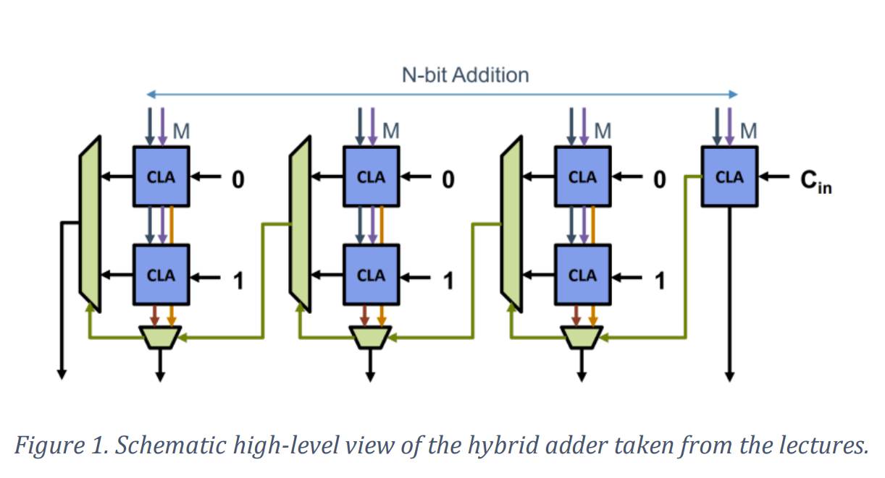

# Arithmetic-Circuits

The goal of this project was to work on the design and implementation of hardware accelerators for large integer arithmetic. In particular, we implemented a set of digital circuits on an FPGA capable of performing basic operations on numbers of size 512 bits. The FPGA works at 125 MHz, hence the arithmetic circuits need to be designed to meet this timing constraint. 

The high-level view of the final project is captured in the diagram below. Next to the hardware accelerators, we also designed an FSM that controls the accelerators and that provides external communication via a serial UART interface. With this setup, we were able to prototype our whole design by exchanging commands/data between the FPGA and our own laptop using Python scripts.

**Disclaimer:** This was a project completed by Chrysovalantis Psilos and Wenjie Zhu for the course "Complex Digital Design" taught at KULeuven. Please <a href="https://onderwijsaanbod.kuleuven.be/2022/syllabi/e/T3WDO2E.htm#activetab=doelstellingen_idp1376960"> click here </a> for more information regarding the course and its goals. A .zip file containing the entire project is included as well.

# Report

## <u> 1. Project features summary </u>

In this project, the FPGA receives two operands A and B along with a command C from a python
script using the UART protocol. Then, it performs the operation indicated from the user and
transmits the result using the mentioned protocol. The adder used has a width of 32 bits, requiring
16 clock cycles to complete the addition of the two 512-bit operands. The project supports addition,
subtraction and comparison by using +, - and = respectively.

## <u> 2. Technical Description of Arithmetic Designs </u>

### 2.1 <u> 32bit-adder </u>

To ensure that the timing constraints will be satisfied for an ADDER_WIDTH = 32 bits, a hybrid
adder that implements features of the carry select adder and the carry lookahead adder was used.
The schematic high-level diagram of the hybrid adder as well as the real-life implementation of the
adder can be seen in the figures below :

The adder follows the design shown in Figure 1. More specifically, it consists of four 8-bit Carry
lookahead adders (CLAs) which are known as slices. As shown in Figure 3, each of these slices
consist of two 8-bit CLAs and 2 multiplexers, one for the carry and the sum respectively. 

The hybrid adder follows the working principle of the carry select adder but uses CLAs instead of
the RCAs. To be more specific, both CLAs from figure 3 pre-computes the result using the actual
inputs and a pre-determined input carry (iCarry) and saves it in the corresponding multiplexer
without having to wait for the actual iCarry signal to arrive. Then, the correct output is selected via
the multiplexers once iCarry is available.

### 2.2 <u> Subtractor & Comparator </u>

Subtraction and comparison are supported, as stated above. To make this happen, we add an extra
input iAddSub that determines whether the operands are added or subtracted to the mp_adder.
To perform the subtraction inside the mp_adder, we use multiplexers for muxB_Out and
muxCarry_Out. If we have input iAddSub=1, we invert all bits of B and then use an input carry of 1.
This is equivalent to taking the two's complement of iOpB. Once the operation is completed, the
result is sent to the python script where we compare it with the expected result to deduce whether
the output of the adder is correct or not.

## 3. <u> Performance evaluation of arithmetic design </u>

The post-synthesis report regarding the worst-case delays and the area costs for the hybrid adder
with ADDER_WIDTH = 32 can below.
From Figure 4, we can conclude that the worst-case delay is 4.684ns (3.539ns + 1.145ns),
corresponding to the net + logic delay of the worst path and the worst-negative slack (WNS) to be
3.180ns (Figure 5).

From Figure 6, we can conclude that the total area cost is 2708 ( 1138 LUTs + 1570 FFs).

## 4. <u> Conclusion </u>

In the figures below, you can find the worst-case delays and total area cost of the mp_adder when a
ripple carry adder is used instead of the hybrid one, with ADDER_WIDTH=16.
Worst-case delay of (1.509ns + 3.822ns = 5.331ns), corresponding to the logic + net delays of the
worst path.
Area cost of 2646 (1073 LUTs + 1573 FFs).

To conclude, based on the theory, we expect a trade off between area and latency, meaning that
when the latency increases the area of the design will decrease and vice versa. Therefore, we
expected that the hybrid adder will provide a lower latency than the RCA and so its area will
increase. The results are in line with our expectations. To be more specific, as you can see in Table
1, the hybrid adder provides a worst-case delay of 4.684ns which is lower by 12% compared to the
worst-case delay of the RCA. Finally, the hybrid adder has a total area cost of 2708 which is increased by 2.29% compared to the RCA 2646.

